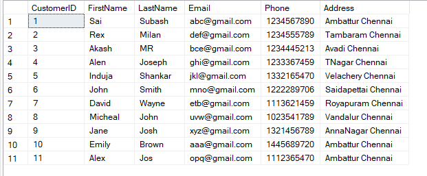

# SQL Assignment

## Task 1

1. Create the database named "TechShop" :

```sql
    create database TechShop;
    use TechShop;
```

2. Define the schema for the Customers, Products, Orders, OrderDetails and Inventory tables
   based on the provided schema.

```sql
    CREATE TABLE [Customers] (
  [CustomerID] Int,
  [FirstName] Varchar(255),
  [LastName] Varchar(255),
  [Email] Varchar(255),
  [Phone] Int,
  [Address] Varchar(255),
);

CREATE TABLE [Products] (
  [ProductID] Int,
  [ProductName] Varchar(255),
  [Description] Varchar(255),
  [Price] Decimal,
);

CREATE TABLE [Orders] (
  [OrderID] Int,
  [CustomerID] Int,
  [OrderDate] Date,
  [TotalAmount] Decimal(10,2),
);

CREATE TABLE [OrderDetails] (
  [OrderDetailID] Int,
  [OrderID] Int,
  [ProductID] Int,
  [Quantity] Int,
);

CREATE TABLE [Inventory] (
  [InventoryID] Int,
  [ProductID] Int,
  [QuantityInStock] Int,
  [LastStockUpdate] Date,
);
```

3. Create an ERD (Entity Relationship Diagram) for the database.


4. Create appropriate Primary Key and Foreign Key constraints for referential integrity.

```sql
    CREATE TABLE [Customers] (
  [CustomerID] Int,
  [FirstName] Varchar(255),
  [LastName] Varchar(255),
  [Email] Varchar(255),
  [Phone] Int,
  [Address] Varchar(255),
  PRIMARY KEY ([CustomerID])
);

CREATE TABLE [Products] (
  [ProductID] Int,
  [ProductName] Varchar(255),
  [Description] Varchar(255),
  [Price] Decimal,
  PRIMARY KEY ([ProductID])
);

CREATE TABLE [Orders] (
  [OrderID] Int,
  [CustomerID] Int,
  [OrderDate] Date,
  [TotalAmount] Decimal(10,2),
  PRIMARY KEY ([OrderID]),
  Foreign key ([CustomerID]) references Customers([CustomerID])
);

CREATE TABLE [OrderDetails] (
  [OrderDetailID] Int,
  [OrderID] Int,
  [ProductID] Int,
  [Quantity] Int,
  PRIMARY KEY ([OrderDetailID]),
  Foreign key ([OrderID]) references Orders([OrderID]),
  Foreign key ([ProductID]) references Products([ProductID])
);

CREATE TABLE [Inventory] (
  [InventoryID] Int,
  [ProductID] Int,
  [QuantityInStock] Int,
  [LastStockUpdate] Date,
  PRIMARY KEY ([InventoryID]),
  Foreign key ([ProductID]) references Products([ProductID])
);
```

5. Insert at least 10 sample records into each of the following tables.

- Customers

```sql
    insert into Customers values
    (1,'Sai','Subash','abc@gmail.com',1234567890,'Ambattur Chennai'),
    (2,'Rex','Milan','def@gmail.com',1234555789,'Tambaram Chennai'),
    (3,'Akash','MR','bce@gmail.com',1234445213,'Avadi Chennai'),
    (4,'Alen','Joseph','ghi@gmail.com',1233367459,'TNagar Chennai'),
    (5,'Induja','Shankar','jkl@gmail.com',1332165470,'Velachery Chennai'),
    (6,'John','Smith','mno@gmail.com',1222289706,'Saidapettai Chennai'),
    (7,'David','Wayne','pqr@gmail.com',1113621459,'Royapettai Chennai'),
    (8,'Micheal','John','uvw@gmail.com',1023541789,'Vandalur Chennai'),
    (9,'Jane','Josh','xyz@gmail.com',1321456789,'AnnaNagar Chennai'),
    (10,'Emily','Brown','aaa@gmail.com',1445689720,'Ambattur Chennai');
```

- Products

```sql
    insert into Products values
    (1,'HP Pavilion Laptop','Gaming Laptop with Ryzen 5',40000.00),
    (2,'Vivo T3','Smartphone with Dimensity 7200',20000.00),
    (3,'Samsung Tablet','10 inch Tablet',15000.00),
    (4,'Boat Headphones','Headphone with ANC',5000.00),
    (5,'Boat Smartwatch','Fitness tracking watch',4000.00),
    (6,'Samsung Smartphone','Smartphone with Amoled display',45000.00),
    (7,'PS5','Gaming Console',50000.00),
    (8,'Logitech Keyboard','Gaming Keyboard',2000.00),
    (9,'Boat Speaker','Bluetooth Speaker',4500.00),
    (10,'Logitech Mouse','Gaming mouse',1500.00);
```

- Orders

```sql
    insert into Orders values
    (1,1,'2024-01-02',140000.00),
    (2,2,'2024-01-05',120000.00),
    (3,3,'2024-01-03',60000.00),
    (4,4,'2024-01-03',10000.00),
    (5,5,'2024-02-04',36000.00),
    (6,6,'2024-02-01',30000.00),
    (7,7,'2024-01-06',40000.00),
    (8,8,'2024-02-05',315000.00),
    (9,9,'2024-01-04',200000.00),
    (10,10,'2024-02-02',1500.00);
```

- OrderDetails

```sql
    insert into OrderDetails values
    (1,1,2,7),
    (2,2,1,3),
    (3,3,3,4),
    (4,4,8,5),
    (5,5,9,8),
    (6,6,4,6),
    (7,7,5,10),
    (8,8,6,7),
    (9,9,7,4),
    (10,10,10,1);
```

- Inventory

```sql
    insert into Inventory values
    (1,1,15,'2024-01-01'),
    (2,2,17,'2024-01-01'),
    (3,3,16,'2024-01-01'),
    (4,4,20,'2024-01-01'),
    (5,5,30,'2024-01-01'),
    (6,6,15,'2024-01-01'),
    (7,7,17,'2024-01-01'),
    (8,8,19,'2024-01-01'),
    (9,9,50,'2024-01-01'),
    (10,10,19,'2024-01-01');
```

## Task 2

1. Write an SQL query to retrieve the names and emails of all customers.

```sql
    select FirstName, LastName, Email from Customers;
```

| FirstName | LastName | Email         |
| --------- | -------- | ------------- |
| Sai       | Subash   | abc@gmail.com |
| Rex       | Milan    | def@gmail.com |
| Akash     | MR       | bce@gmail.com |
| Alen      | Joseph   | ghi@gmail.com |
| Induja    | Shankar  | jkl@gmail.com |
| John      | Smith    | mno@gmail.com |
| David     | Wayne    | etb@gmail.com |
| Micheal   | John     | uvw@gmail.com |
| Jane      | Josh     | xyz@gmail.com |
| Emily     | Brown    | aaa@gmail.com |

2. select OrderID, OrderDate, FirstName, LastName from Orders inner join Customers on Orders.CustomerID = Customers.CustomerID;

| OrderID | OrderDate  | FirstName | LastName |
| ------- | ---------- | --------- | -------- |
| 1       | 2024-01-02 | Sai       | Subash   |
| 2       | 2024-01-05 | Rex       | Milan    |
| 3       | 2024-01-03 | Akash     | MR       |
| 4       | 2024-01-03 | Alen      | Joseph   |
| 5       | 2024-02-04 | Induja    | Shankar  |
| 6       | 2024-02-01 | John      | Smith    |
| 7       | 2024-01-06 | David     | Wayne    |
| 8       | 2024-02-05 | Micheal   | John     |
| 9       | 2024-01-04 | Jane      | Josh     |
| 10      | 2024-02-02 | Emily     | Brown    |

3. Write an SQL query to insert a new customer  
   record into the "Customers" table. Include
   customer information such as name, email, and address.

```sql
    insert into Customers values
    (11,'Alex','Jos','opq@gmail.com',1112365470,'Ambattur Chennai');
```

;

4.  Write an SQL query to update the prices of all electronic gadgets in the "Products" table by
    increasing them by 10%.

```sql
    update Products
    set Price = Price * 1.1;
```


5. Write an SQL query to delete a specific order and its associated order details from the
   "Orders" and "OrderDetails" tables. Allow users to input the order ID as a parameter.

```sql
    declare @i int = 1;

    delete from OrderDetails where OrderID=@i;
    delete from Orders where OrderID=@i;
```

6. Write an SQL query to insert a new order into the "Orders" table. Include the customer ID,
   order date, and any other necessary information.

```sql
    insert into Orders values
    (11,10,'2024-02-02',1500.00);
```

7. Write an SQL query to update the contact information (e.g., email and address) of a specific
   customer in the "Customers" table. Allow users to input the customer ID and new contact
   information.

```sql
    declare @u int = 7;

    update Customers
    set Email='aex@gmail.com' , Address='Velachery Chennai' where CustomerID = @u;
```


8. Write an SQL query to recalculate and update the total cost of each order in the "Orders"
   table based on the prices and quantities in the "OrderDetails" table.

```sql
    update Orders
    set TotalAmount =
    (select (od.Quantity * p.Price) as TotalAmount from Products p
    join OrderDetails od on p.ProductID = od.ProductID where
    od.OrderID = Orders.OrderID);
```


9. Write an SQL query to delete all orders and their associated order details for a specific
   customer from the "Orders" and "OrderDetails" tables. Allow users to input the customer ID
   as a parameter.

```sql
    declare @d int = 1;

    delete from OrderDetails
    where OrderID in ( select OrderID from Orders where CustomerID = @d);

    delete from Orders where CustomerID = @d;
```

10. Write an SQL query to insert a new electronic gadget product into the "Products" table,
    including product name, category, price, and any other relevant details.

```sql
    insert into Products values
    (11,'Bose Soundbar','High quality Soundbar',10000.00);
```

11. Write an SQL query to update the status of a specific order in the "Orders" table (e.g., from
    "Pending" to "Shipped").

```sql
    alter table Orders
    add Status;

    update Orders
    set Status = 'Pending'

    update Orders
    set Status = 'Shipped'
    where OrderID = 1;
```


12. Write an SQL query to calculate and update the number of orders placed by each customer
    in the "Customers" table based on the data in the "Orders" table.

```sql
    --By creating a new column in the Customers Table

    alter table Customers
    add NoofOrders int;

    update Customers
    set NoofOrders = (select count(OrderId) from Orders where Orders.CustomerID = Customers.CustomerId);

-- Without Creating a new column

    select CustomerId, count(OrderId) as NoofOrders from Orders group by CustomerID;
```

## Task 3

1. Write an SQL query to retrieve a list of all orders along with customer information (e.g.,
   customer name) for each order.

```sql
    select c.FirstName, p.ProductName, o.OrderID,od.Quantity from Customers c
    join Orders o on c.CustomerID = o.CustomerID join OrderDetails od on o.OrderID = od.OrderID
    join Products p on p.ProductID = od.ProductID;
```


2. Write an SQL query to find the total revenue generated by each electronic gadget product.
   Include the product name and the total revenue.

```sql
    select ProductName, (od.Quantity * p.Price)
    as TotalRevenue from Products p inner join OrderDetails od
    on p.ProductID = od.ProductID;
```


3. Write an SQL query to list all customers who have made at least one purchase. Include their
   names and contact information.

```sql
    select FirstName, LastName, Email, Address from Customers inner join Orders on Customers.CustomerID = Orders.CustomerID;
```


4. Write an SQL query to find the most popular electronic gadget, which is the one with the highest
   total quantity ordered. Include the product name and the total quantity ordered.

```sql
    --One way
    select ProductName, Quantity from Products inner join
    ( select top 1 Quantity, ProductID from OrderDetails order by Quantity desc ) as i
    on Products.ProductID = i.ProductID;

--2nd way
    select ProductName, Quantity from Products inner join OrderDetails
    on Products.ProductID = OrderDetails.ProductID
    where Products.ProductID = (select top 1 ProductID from OrderDetails order by Quantity desc);
```


5. Write an SQL query to retrieve a list of electronic gadgets along with their corresponding
   categories.

```sql
    -- There is no Category Column, so Creating one in the Products Column
    alter table Products
    add Category int;


    update Products
    set Category = 1
    where ProductID IN (1, 2, 3);

    update Products
    set Category = 2
    where ProductID IN (4, 5);

    update Products
    set Category = 3
    where ProductID IN (6, 7);

    update Products
    set Category = 4
    where ProductID IN (8, 9);

    update Products
    set Category = 5
    where ProductID IN (11);

    -- Solution for the Query
    select ProductName, Category from Products;

```


6. Write an SQL query to calculate the average order value for each customer. Include the
   customer's name and their average order value.

```sql
    --select FirstName, Avg(TotalAmount) as AverageOrderValue
    --from Customers inner join Orders on Customers.CustomerID = Orders.CustomerID
    --group by FirstName;

    select c.CustomerID, FirstName, LastName , t.AverageAmt from Customers c
    join ( select O.CustomerID, (O.TotalAmount/od.Quantity) as AverageAmt from Orders O join OrderDetails od on O.OrderID = od.OrderID) as
    t on c.CustomerId = t.CustomerID;

```


7. Write an SQL query to find the order with the highest total revenue. Include the order ID,
   customer information, and the total revenue.

```sql
    select top 1 FirstName, OrderID, TotalAmount from Customers inner join Orders
    on Customers.CustomerID = Orders.CustomerID order by TotalAmount desc;
```


8. Write an SQL query to list electronic gadgets and the number of times each product has been
   ordered.

```sql
   select p.ProductName, Quantity as NoOfTimes from Products p inner join OrderDetails od on
    p.ProductID = od.ProductID;
```


9. Write an SQL query to find customers who have purchased a specific electronic gadget product.
   Allow users to input the product name as a parameter

```sql
    DECLARE @name varchar(255);
    set @name = 'HP Pavilion Laptop';

    select c.FirstName, o.OrderID, od.Quantity from Customers c join Orders o
    on c.CustomerID = o.CustomerID join OrderDetails od on od.OrderID = o.OrderID join Products p
    on p.ProductID = od.ProductID where p.ProductName = @name;

    --Another Way

    select FirstName, LastName from Customers where CustomerID =
    ( select CustomerID from Orders where OrderID =
    ( select OrderID from OrderDetails inner join Products on
    OrderDetails.ProductID = Products.ProductID where ProductName =  'HP Pavilion Laptop'  ));
```


10. Write an SQL query to calculate the total revenue generated by all orders placed within a
    specific time period. Allow users to input the start and end dates as parameters.

```sql
    select sum(TotalAmount) as TotalRevenue from Orders where OrderDate between '2024-01-02' and '2024-01-03';
```

;

## Task 4

1. Write an SQL query to find out which customers have not placed any orders.

```sql
    select FirstName, LastName from Customers where CustomerID not in (select CustomerID from Orders);
```

;

2. Write an SQL query to find the total number of products available for sale.

```sql
    select count(ProductName) as NumberOfProducts from Products where ProductID in
    (select ProductID from Inventory where QuantityInStock > 0);
```


3. Write an SQL query to calculate the total revenue generated by TechShop.

```sql
    select sum(TotalAmount) as TotalRevenue from Orders;
```


4. Write an SQL query to calculate the average quantity ordered for products in a specific category

```sql
    declare @cat int = 1;

    select Category, avg(Quantity) as AvgOrder from
    (select p.Category, od.Quantity from Products p join OrderDetails od on
    p.ProductID = od.ProductID where p.Category = @cat) as i
    group by Category;
```


5. Write an SQL query to calculate the total revenue generated by a specific customer. Allow users
   to input the customer ID as a parameter.

```sql
    Declare @cust int = 10;

    select sum(TotalAmount) as TotalRevenue from Orders where CustomerID = @cust;
```


6. Write an SQL query to find the customers who have placed the most orders.

```sql
    select FirstName, LastName, i.NoOfOrders as NoOfOrders from Customers c inner join
    (select Top 1 CustomerID, od.Quantity as NoOfOrders from Orders o inner join OrderDetails od on
    o.OrderID = od.OrderID order by od.Quantity desc) as i on c.CustomerID = i.CustomerID ;
```

;

7. Write an SQL query to find the most popular product category, which is the one with the highest
   total quantity ordered across all orders.

```sql
    select Top 1 Category, sum(od.Quantity) as NoOfOrders from Products join
    (select ProductID, Quantity from OrderDetails ) as od on Products.ProductID = od.ProductID
    group by Category order by NoOfOrders desc;
```

;

8. Write an SQL query to find the customer who has spent the most money (highest total revenue)
   on electronic gadgets. List their name and total spending.

```sql
    select top 1 FirstName, LastName, (TotalSpending) from (select FirstName, LastName, o.TotalAmount as TotalSpending from Customers join
    (select CustomerID, TotalAmount from Orders) as o on
    Customers.CustomerID = o.CustomerID) as e order by TotalSpending desc;
```

;

9. Write an SQL query to calculate the average order value (total revenue divided by the number of
   orders) for all customers.

```sql
    select c.CustomerID, FirstName, LastName , t.AverageAmt from Customers c
    join ( select O.CustomerID, (O.TotalAmount/od.Quantity) as AverageAmt from Orders O join OrderDetails od on O.OrderID = od.OrderID) as
    t on c.CustomerId = t.CustomerID;
```

;

10. Write an SQL query to find the total number of orders placed by each customer and list their
    names along with the order count.

```sql
    select FirstName, LastName, OrdCount from Customers c
    join (select o.CustomerID, od.Quantity as OrdCount from Orders o join OrderDetails od on o.OrderID = od.OrderID) as
    t on c.customerID = t.CustomerID;
```

;
